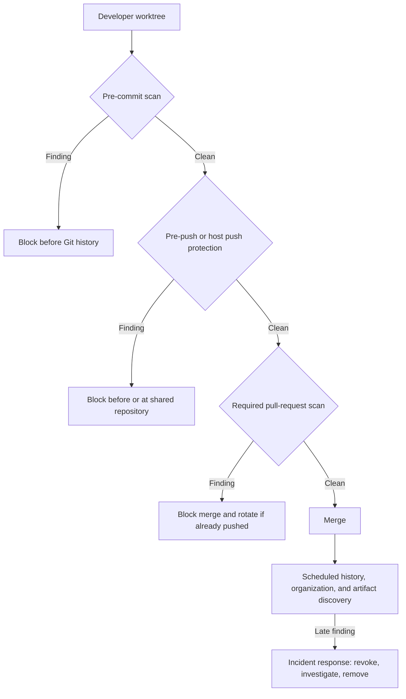

# Secret scanning: reducing credential leaks before they become incidents

> **Defensive scope:** This article and its executable example are for educational and defensive use on a local repository or a system the reader is explicitly authorized to test. The fixtures contain no live credential, contact no provider, and pair the vulnerable case with its mitigation.

Secret scanning is a detection and prevention control for credentials and other secret values that appear in source code, Git history, configuration, build artifacts, or collaboration systems. It reduces—but cannot eliminate—the chance that possession of a repository becomes possession of a production system.

The central engineering rule is simple: **catch a secret at the earliest practical point, enforce the decision again at the shared boundary, and store the real value somewhere designed for secret lifecycle management.** A scanner is not a secret manager, and a clean scan means only that the configured detectors did not report a match.

This article was last updated on **2026-08-25** using the primary references listed below. The controlled comparison uses Gitleaks 8.30.1 and TruffleHog 3.97.1; GitHub Secret Protection is covered from its current product documentation because it is a host-native service.

## A practical definition of a secret

A **secret** is a value whose confidentiality is part of a security decision: possession lets a person or machine authenticate, authorize an action, decrypt data, sign an artifact, or impersonate a trusted party. Common examples include:

- passwords and database connection strings containing passwords;
- API keys, personal access tokens, OAuth tokens, session tokens, and webhook signing secrets;
- private SSH, TLS, code-signing, and package-signing keys;
- symmetric encryption keys and recovery codes;
- cloud access keys, service-account credentials, and CI/CD deployment credentials.

This is a practical engineering definition, not a formal taxonomy. [OWASP's Secrets Management Cheat Sheet](https://cheatsheetseries.owasp.org/cheatsheets/Secrets_Management_Cheat_Sheet.html) uses a similarly broad set of examples and emphasizes storage, provisioning, auditing, rotation, and revocation as one lifecycle.

Several related values are sensitive without being secrets. A cryptographic public key, a certificate's public portion, a hostname, or an OAuth client identifier normally does not authorize access by itself. Personal data and proprietary source code may require confidentiality controls, but a secret scanner is not a data-loss-prevention system and should not be represented as one.

## Why one leaked value becomes a business risk

A secret collapses an identity check into a reusable string or key. If that value is overprivileged, long-lived, or shared across environments, a small coding error can become a large authorization failure.

The direct technical effects can include unauthorized cloud or database access, data exfiltration, resource abuse, malicious software publication, deployment tampering, or service interruption. The business effects follow from that access: incident-response labor, emergency rotation and downtime, customer notification, contractual or regulatory exposure, fraud and cloud spend, supply-chain impact, and loss of trust.

The risk does not depend on a repository being public. Private repositories are copied to developer machines, CI runners, backups, mirrors, integrations, and third-party applications. Their access controls can also be bypassed by a compromised user or token.

### Real incidents show the complete path

| Incident | What happened | Decision it supports |
| --- | --- | --- |
| Uber, 2014 and 2016 | The US Federal Trade Commission alleged that a publicly posted AWS key with broad privileges enabled the 2014 access to driver data. In the 2016 breach, [Uber admitted that attackers used stolen credentials to enter a private source repository, obtained a private access key, and then copied data associated with about 57 million records](https://www.justice.gov/usao-ndca/pr/uber-enters-non-prosecution-agreement). | Public exposure is dangerous, but “private repository” is not a secret-storage control. Scope and repository access security determine blast radius. |
| GitHub/npm, 2022 | [GitHub reported that stolen OAuth tokens were used to download private repositories](https://github.blog/news-insights/company-news/security-alert-stolen-oauth-user-tokens/). Its investigation linked unauthorized npm infrastructure access to an AWS API key obtained from downloaded private npm repositories. | Attackers mine repositories for credentials that allow a second-stage pivot. Repository access and infrastructure access should not share one failure boundary. |
| CircleCI, 2023 | [CircleCI reported exfiltration of customer environment variables, keys, and tokens](https://circleci.com/blog/jan-4-2023-incident-report/) and told customers to rotate OAuth tokens, project API tokens, SSH keys, and other credentials. | CI secret stores are concentrated trust points. Reduce stored long-lived credentials and design rotation before an incident. |

These cases do not show that scanning alone would have prevented each incident. They describe the mechanism and impact: credentials stored with source or automation can be discovered after another control fails, then reused against a different system. Scanning is one control in that chain.

## If a secret reaches Git, treat it as an incident

Deleting the line in a later commit does not delete the earlier Git object. The value may remain in local clones, remote branches, pull-request references, forks, caches, build output, logs, or backups. History rewriting can reduce future exposure, but it cannot make a copied value unknown again.

Use this response order:

1. **Revoke or rotate first.** Invalidate the exposed credential at its issuing system. [GitHub's history-cleanup guidance](https://docs.github.com/en/authentication/keeping-your-account-and-data-secure/removing-sensitive-data-from-a-repository) explicitly puts revocation or rotation before repository rewriting.
2. **Preserve incident records and establish the exposure window.** Identify the first commit, every branch and surface containing the value, who or what could read it, and the time at which revocation completed.
3. **Check for use.** Review provider, identity, cloud, database, CI, and application audit logs for activity within that window. Scope the investigation to the permissions the credential actually had.
4. **Replace the storage pattern.** Move the value to an approved secret manager or workload identity flow, update consumers, and confirm the old credential no longer works.
5. **Remove the value from current content and decide whether to rewrite history.** Coordinate a rewrite with every clone owner. Rewriting changes commit hashes, invalidates signatures, can disrupt open work, and risks recontamination from an old clone.
6. **Search adjacent surfaces.** Check issues, pull requests, wikis, chat, CI logs, artifacts, container layers, package registries, and documentation for the same value or related credentials.
7. **Add a regression guard.** Create a safe detector test for the credential format and enforce it at the earliest gate plus a shared gate.

Do not commit a real leaked value as a scanner regression fixture. Use a provider's documented test token when one exists, or use a repository-only fictional format such as the controlled fixture in this repository.

## Put gates before commit, at push, and before merge

A layered design is more resilient because each control sees a different state and has a different bypass path.



*Practical layered control model. “Clean” means no configured detector fired; it does not assert that no secret exists. All targets are local or explicitly authorized.*

| Gate | What it prevents or detects | Limitation |
| --- | --- | --- |
| Editor or manual working-tree scan | Gives fast feedback before staging | Optional and easy to forget; editor coverage varies |
| Pre-commit hook | Stops a matching value before a commit object is created | Installed per clone and bypassable with hook controls |
| Pre-push hook | Catches committed history before it leaves the workstation | Still local and bypassable; a full-history scan can be slower |
| Host push protection or pre-receive hook | Enforces a shared boundary before or as data reaches the host | Product, plan, pattern, and bypass-policy limitations apply |
| Required pull-request CI check | Gives a reproducible team-visible merge gate | A secret pushed to a feature branch is already on the remote; the check gates merge, not initial exposure |
| Scheduled full-history and organization scan | Finds legacy secrets, unmerged branches, and control drift | Detective rather than preventive; results require ownership and remediation |
| Artifact, image, package, and log scan | Catches secrets copied outside source files | Requires tools that understand those formats and storage systems |

The recommended portable baseline in this repository is **Gitleaks at pre-commit, pre-push, and central CI**. The central workflow runs on every push and pull request, again when a merge creates a push to the target branch, and once daily; its pull-request status should be required. If the repository is eligible, add **GitHub push protection at the hosted push boundary**. Use **TruffleHog for scheduled discovery or authorized incident triage** when its source coverage or provider checks address a real business requirement. Do not run every engine at every gate by default.

## What to evaluate in a secret-scanning tool

A feature count is less useful than a test against the organization's real secret lifecycle. Evaluate these properties:

1. **Scope:** Does it inspect staged changes, complete Git history, all references, untracked files, archives, generated files, container layers, CI logs, issues, wikis, and artifact stores as required? A shallow CI checkout silently narrows a history scan.
2. **Detector coverage:** Check the actual providers, token versions, key pairs, generic credentials, private keys, and organization-specific formats. Test both true and false cases.
3. **Signal and provider checks:** Measure true positives and false positives on safe synthetic data. If the tool checks whether credentials are active, document the network destination, permissions exercised, audit trail, rate limits, and handling of indeterminate results.
4. **Gate semantics:** Confirm which exit codes represent findings and scanner failures, whether errors fail closed, which findings block, and whether the status check is truly required. Gitleaks exit code 1 can represent a leak or an error, so the controlled test also checks for the expected rule in its report.
5. **History and diff behavior:** A pull-request diff scan is fast but cannot find an old credential outside the diff. Use separate full-history onboarding and scheduled scans, and test the root-commit/initial-push case.
6. **Safe output:** Findings, logs, annotations, artifacts, and notifications must redact the value. Limit who can download reports. A scanner that republishes the credential widens the incident.
7. **Baselines and exceptions:** Require an owner, reason, scope, and review or expiry date. Prefer a narrow fingerprint or path/rule exception. Do not disable a detector to silence one false positive.
8. **Custom rules and testability:** Inventory internal API keys, session formats, signing values, legacy credentials, and other patterns no vendor can know by default. Version custom patterns beside safe positive and negative fixtures. Validate each engine's regular-expression syntax and decoding behavior rather than assuming the same expression behaves identically everywhere.
9. **Performance and reliability:** Measure monorepo history, large pushes, binaries, nested archives, submodules, and timeouts. A control that teams routinely bypass is not an effective gate.
10. **Operational fit:** Review alert routing, deduplication, stable fingerprints, audit events, bulk revocation support, metrics, and integration with the incident process.
11. **Tool security and maintenance:** Pin versions or immutable action commits, check release checksums, run with read-only repository access, avoid exposing unrelated CI secrets to the scanner job, and monitor the project's release and maintenance posture.
12. **License, plan, and data boundary:** Confirm open-source license obligations, hosted-service data handling, repository eligibility, enterprise-server version differences, and the cost of every repository and committer in scope.

Turn those questions into pass/fail requirements before comparing product names. For this repository, the blocking gate must be portable, offline, fast enough for local use, able to scan full Git history in CI, configurable with a versioned custom rule, and capable of redacted output. Wider-source discovery and live-credential validation are valuable but not required on every commit.

## Comparing Gitleaks, TruffleHog, and GitHub Secret Protection

### Apply the evaluation criteria before selecting a gate

The comparison below separates two questions that are often collapsed:

1. **What did these pinned local configurations detect in this corpus?** This is measured by the executable harness.
2. **What does GitHub document for its hosted control?** This identifies patterns and limitations to test in an eligible disposable repository; it is not recorded as a local result.

The corpus contains 15 credential-shaped positive scenarios and three safe negatives. It represents major technical shapes—passwords, credential URLs, authorization headers, provider tokens, paired cloud keys, OAuth secrets, service accounts, private and symmetric keys, webhook secrets, internal formats, encoded material, runtime references, placeholders, and public keys. It is a regression sample, not a claim to contain every provider or token version.

Gitleaks and TruffleHog receive equivalent custom rules for the fictional internal format. Gitleaks is configured for one decoding pass. TruffleHog provider checks are disabled. All credential-shaped values are assembled under `mktemp`; no complete value is committed.

| Credential shape | Desired decision | Gitleaks 8.30.1 local result | TruffleHog 3.97.1 local result | GitHub documented behavior / host test |
| --- | --- | --- | --- | --- |
| Custom internal token | Block | Detected: `synthetic-demo-api-key` | Detected: `CustomRegex` | Defaults cannot know the format; configure, dry-run, publish, and push-protect a custom pattern |
| Username/password assignment | Block | Detected: `generic-api-key` | Missed | Passwords are AI-detected alert patterns; GitHub documents no push protection or validity checks for passwords |
| PostgreSQL credential URL | Block | Missed | Detected: `Postgres` | `postgres_connection_string` is a generic alert pattern; test whether the configured push gate blocks it |
| HTTP Basic credential | Block | Missed | Missed | `http_basic_authentication_header` is a generic alert pattern; test hosted alert and push behavior |
| Bearer JWT/header | Block | Detected: `jwt` | Missed | `http_bearer_authentication_header` is generic; provider-token patterns are separate, so record the pattern that fires |
| GitHub PAT-shaped token | Block | Missed | Detected: `Github` | Supported provider pattern; push protection applies to supported identifiable token versions, so test the synthetic shape remotely |
| OAuth client secret | Block | Detected: `generic-api-key` | Missed | Depends on provider format or an organization custom pattern |
| AWS pair in one file | Block | Detected: `generic-api-key` | Detected: `AWS` | AWS access-key-pair pattern supports push protection |
| AWS pair split across files | Block | Detected one generic value | Missed | GitHub documents that paired patterns are detected only when both parts occur in the same file |
| Service-account configuration with private key | Block | Detected: `private-key` | Detected: `PrivateKey` | Test provider-specific and generic private-key patterns separately |
| RSA private key | Block | Detected: `private-key` | Detected: `PrivateKey` | `rsa_private_key` is a generic alert pattern |
| OpenSSH private key | Block | Detected: `private-key` | Detected: `PrivateKey` | `openssh_private_key` is a generic alert pattern |
| Symmetric encryption key | Block | Detected: `generic-api-key` | Missed | Requires a recognized provider shape or a custom pattern |
| Webhook signing secret | Block | Detected: `generic-api-key` | Missed | Requires a supported provider shape or a custom pattern |
| Base64-encoded internal token | Block | Detected after one decoding pass; two signals | Detected: `CustomRegex` | Test encoded representations; do not assume a plain custom pattern decodes content |
| Runtime reference | Pass | Passed | Passed | Safe negative: no credential value is present |
| Placeholder | Pass | Passed | Passed | Safe negative: no credential value is present |
| SSH public key | Pass | Passed | Passed | Safe negative: a public key does not authenticate as the private key |

Gitleaks detected 12 of the 15 positive scenarios and TruffleHog detected eight. Those fractions are not production accuracy rates: the cases are deliberately diverse, not statistically sampled, and one encoded value produces two Gitleaks signals. The useful facts are the individual gaps. Both missed the Basic-auth shape. Gitleaks missed the PostgreSQL URL and PAT-shaped token; TruffleHog missed several generic assignments and JWT/OAuth/symmetric/webhook shapes. A tool can therefore be the right gate without being the only detector in the program.

GitHub's documentation fills part of the capability picture: it lists generic alert patterns for Basic and Bearer headers, database connection strings, and private keys, AI detection for passwords, provider patterns, and user-defined custom patterns. But alerts and push blocking are not the same. GitHub documents that push protection covers only a subset, does not support password patterns, recognizes only supported token versions, can time out or skip large pushes, and does not combine paired credentials across files. The [hosted test procedure](results/github-secret-protection-test-procedure.md) records what to run before relying on that gate.

### Capability comparison against the evaluation criteria

| Decision factor | Gitleaks 8.30.1 | TruffleHog 3.97.1 | GitHub Secret Protection |
| --- | --- | --- | --- |
| Best fit | Portable, offline local and CI gate over files and Git history | Discovery across many repositories and non-Git sources, with optional provider checks | GitHub-native push prevention, alerting, governance, and organization visibility |
| Detection model | Built-in and custom regular expressions, keywords, optional entropy, and configurable decoding | Provider-specific detectors plus custom detectors; many detectors can check provider APIs | Provider, generic, AI-detected, and custom patterns with platform-managed updates |
| Custom/internal formats | TOML rule with regex, keywords, entropy, allowlists, and safe regression fixtures | YAML custom detector with keywords and named regexes; optional character requirements and webhook check; currently documented as alpha | Repository/organization/enterprise custom patterns, dry runs, publishing, and optional push protection where the feature is enabled |
| Active validity check | No built-in provider login check; suited to offline scanning | Can contact issuing APIs; results may be active, inactive, unknown, or not checked depending on detector and response | Validity checks exist for supported patterns; provider partnerships can receive some public-leak alerts |
| Gate semantics | Pre-commit integration and configurable nonzero exit; JSON, JUnit, CSV, and SARIF | Pre-commit/CI support; `--fail` returns 183 for findings; JSON and SARIF | Native push protection, bypass governance, alerts, security overview, and remediation workflows |
| Coverage beyond a checked-out repository | Filesystem, Git history, standard input, and configured archives | GitHub organizations/repositories and some issues or pull-request content, GitLab, filesystems, Docker/images, S3, GCS, Postman, Jenkins, Elasticsearch, Hugging Face, and other sources | [GitHub-hosted coverage](https://docs.github.com/en/code-security/concepts/secret-security/secret-security-with-github) can include history, pull requests, issues, wikis, and discussions |
| Deployment and cost boundary | Open-source MIT binary; runs locally or in any CI | Open-source AGPL-3.0 binary; enterprise service is separate | Public repositories receive core scanning free. As of 2026-08-25, much organization-owned private/internal coverage requires GitHub Secret Protection and an eligible Team or Enterprise arrangement |
| Main caveat | No provider validity check; local rules and upgrades are the operator's responsibility | Provider checks require approved egress and careful result handling; raw output can contain matches; custom detectors are alpha | GitHub-specific and plan-gated for much private use; push protection has pattern, size, timeout, pair, version, and bypass limits |

“Broad discovery” describes TruffleHog's **source reach and optional provider checks**, not a blanket claim that its file detector library is more effective. It can enumerate and scan places a checkout-based Gitleaks job does not see, including repositories across a GitHub organization, some collaboration content, object stores, container images, and CI systems. Its experimental GitHub object discovery can also search some deleted or otherwise hidden objects, with documented maturity and runtime caveats. The local matrix shows why this distinction matters: TruffleHog found the PostgreSQL and GitHub-token shapes that Gitleaks missed, but missed other shapes that Gitleaks found.

### Custom formats need their own miniature test suite

All three products can model organization-specific formats, but “supports custom regex” is not enough:

- **Gitleaks:** version a TOML rule with keywords and a regular expression; use entropy or allowlists only when the format needs them. The repository's `DEMO_…` rule is exercised on plaintext and Base64-encoded input.
- **TruffleHog:** define keywords and one or more named regular expressions. Optional character requirements and a webhook/provider check can add structure, but custom detectors are documented as alpha and raw result fields require careful handling.
- **GitHub:** dry-run a custom pattern before publishing it, then enable custom-pattern push protection only after reviewing likely disruption. Host push protection must also be enabled for the repository.

Maintain at least one safe positive for every supported version of an internal format and negatives for placeholders, public identifiers, documentation examples, and common near-matches. Re-run the cases when a pattern, scanner version, encoding setting, or GitHub feature configuration changes.

### Limitations of the repository experiment

- Fifteen positives and three negatives provide a useful regression matrix but cannot estimate false-positive or false-negative rates.
- The inputs are non-issued shapes, provider checks are disabled, and no result says whether a credential is active.
- Detection of one synthetic shape does not establish coverage of older, newer, shortened, transformed, or malformed versions of that credential.
- GitHub hosted behavior has not been run from this local repository. Its table entries distinguish documented capability from the remote result still to be recorded.
- TruffleHog JSON can contain raw matched material, so the harness keeps it in temporary storage and persists only safe metadata. Gitleaks is run with full redaction.
- The run does not benchmark large histories, archives, images, non-Git sources, collaboration surfaces, provider latency, false positives in production code, or operating cost.
- Tool versions, detector sets, token formats, hosted plans, and platform settings change; re-run the corpus and host test during procurement and upgrades.

## Recommendation: assign one job to each gate

| Gate and business purpose | Default control in this repository | When to add or change it | Blocking? |
| --- | --- | --- | --- |
| Before a commit object exists | Gitleaks staged-content pre-commit hook | Add IDE feedback if it uses the same tested rules | Local only; manually installed and bypassable |
| Before local commits leave a clone | Gitleaks full-history pre-push hook | Keep when developer latency is acceptable | Local only; manually installed and bypassable |
| At the GitHub push boundary | GitHub push protection, when eligible | Add custom patterns for internal formats; do not assume every alert pattern blocks | Yes for supported configured patterns, subject to bypass and documented limits |
| On every pushed commit and pull request | Gitleaks full-history workflow | Make **Gitleaks full-history gate** the required pull-request status | Blocks merge when required; a branch push has already reached GitHub |
| When a merge pushes the target branch | The same Gitleaks workflow runs again on the resulting push | Retains a central check even if a local hook was absent or bypassed | Detects after the merge push; response may require rotation |
| Daily regression and history check | The same Gitleaks workflow runs on schedule | Useful for control drift and default-branch history; it does not replace push protection | Detective |
| Wider-source or possibly active-credential discovery | Weekly/manual TruffleHog workflow with provider checks disabled here | Enable approved provider checks or additional sources only when the business case and data boundary permit | Detective by default |
| Tool evaluation and upgrades | Controlled 18-scenario comparison on pushes and pull requests | Add organization-specific safe cases; update expected outcomes after review | Never the merge gate |

The local hooks improve developer feedback but cannot enforce organization policy because each clone must install them and can bypass them. The CI layer is therefore mandatory for the repository baseline. In this repository it triggers on every push and pull request, on the push produced by a merge, on a daily schedule, and by manual dispatch.

If only one portable scanner can be operated, Gitleaks is the baseline here because it supports the local and central gates, versioned custom rules, redacted reports, and the larger number of positive scenarios in this particular corpus. That conclusion is scoped to these requirements and results, not a universal product ranking.

For an eligible GitHub-hosted repository, add push protection because it occupies the earlier shared boundary that CI cannot: it may block a supported value before GitHub accepts the push. It still may not block a password, an unsupported or older token shape, a paired value split across files, or a push affected by documented size/timeout limits. An organization whose impact and likelihood make those gaps unacceptable can add Gitleaks custom rules, make a second scanner a CI gate, or run it as frequent discovery. The choice depends on its secret inventory, measured misses, false-positive tolerance, response capability, latency, data boundary, and risk appetite.

Add TruffleHog when its different detector results, cross-source reach, or provider checks close an identified gap. For example, this corpus gives a reason to evaluate it for PostgreSQL URLs and GitHub-token shapes, while its source connectors give a separate reason to use it for organization-wide and non-Git discovery. Running it at every gate is justified only if that incremental coverage outweighs duplicate alerts, runtime, output-handling, network, and licensing costs.

## Store fewer secrets, and store the remainder for their full lifecycle

The safest stored secret is one that does not exist. Prefer workload identity, short-lived federation, or dynamic credentials to a static key. For example, [GitHub Actions OpenID Connect](https://docs.github.com/en/actions/concepts/security/openid-connect) lets a workflow exchange its identity for a short-lived cloud token rather than duplicating a long-lived cloud credential in GitHub.

When a static secret is necessary, keep it in a centralized secret-management system such as a cloud secret manager, HashiCorp Vault, or an equivalent platform that provides:

- encryption at rest and in transit;
- fine-grained, least-privilege access by workload identity;
- audit logs for read, write, and administrative access;
- automated creation, rotation, expiry, and revocation;
- separation by application, environment, and trust boundary;
- a tested recovery and break-glass process.

Practical placement rules:

| Context | Preferred pattern | Important caveat |
| --- | --- | --- |
| Application runtime | Fetch or mount the value from a secret manager using workload identity; keep it in memory only as long as required | Environment variables can appear in child processes, diagnostics, or crash output; a permissioned file or provider integration may be safer depending on the platform |
| CI/CD | Prefer OIDC or another provider-supported workload identity flow. If a CI secret is unavoidable, scope it to the job/environment, protect deployment environments, mask logs, and rotate it | Maintainers or modified workflows may be able to cause a secret to be used or exfiltrated; CI is a production trust boundary |
| Local development | Use a password manager, operating-system credential store, or developer identity to retrieve a non-production secret. Keep local `.env` files ignored and short-lived | `.gitignore` is only a backstop. It does not protect a file already committed, force-added, logged, backed up, or copied |
| Kubernetes | Prefer an external secret store or configure Kubernetes Secrets with encryption at rest, least-privilege RBAC, and access only for the consuming container | [Kubernetes documents that Secret objects are stored unencrypted in etcd by default](https://kubernetes.io/docs/concepts/configuration/secret/); Base64 encoding is not encryption |
| Encrypted configuration in Git | Use only under a designed threat model with encryption keys held outside Git, separate recipients per environment, rotation, and audit | Encryption can be valid, but it shifts the problem to key management and can hide plaintext from a repository scanner |

Do not put live values in source, examples, unit-test fixtures, `.env.example`, documentation, screenshots, issue bodies, pull-request descriptions, chat, or log output. Store only the reference, identifier, or lookup path that the runtime needs.

## The repository's reproducible test results

Run the small baseline-gate test with:

```sh
./scripts/test-secret-scan.sh
```

Run the cross-engine corpus with both pinned binaries installed:

```sh
./scripts/compare-secret-scanners.sh
```

The [comparison JSON](results/scanner-comparison-results.json), [Gitleaks-only JSON](results/local-scan-results.json), [Gitleaks rule](.gitleaks.toml), [TruffleHog rule](.trufflehog.yml), and scripts are kept together in this repository. Both harnesses assemble credential-shaped values only under `mktemp` and remove them on exit.

The workflows deliberately have different semantics:

- [Secret scan](.github/workflows/gitleaks.yml) runs Gitleaks on every push and pull request, on the push created by a merge, daily, or by manual dispatch. **Gitleaks full-history gate** is the pull-request status to make required.
- [Controlled scanner comparison](.github/workflows/scanner-comparison.yml) runs the 18-scenario corpus through both engines on pushes, pull requests, or manual dispatch. Its job is named **Comparison only — not a merge gate**.
- [TruffleHog discovery](.github/workflows/trufflehog-discovery.yml) runs weekly or manually over full Git history with outbound provider checks disabled. It is a detective control; a finding enters incident response.
- GitHub push protection is configured on the GitHub host, not in workflow YAML. Confirm plan eligibility, enable the feature, configure custom patterns and bypass governance, and run the [disposable-host test](results/github-secret-protection-test-procedure.md) separately.

All download jobs pin versions, check archive checksums, use read-only repository permissions, and do not persist checkout credentials. Under the versions and conditions described above, the runs returned the listed findings and exit codes. They do **not** measure universal coverage, credential validity, GitHub feature or ruleset configuration, or absence of secrets.

## Operating checklist

- Inventory secret types, issuers, owners, scopes, storage locations, consumers, rotation methods, and revocation paths.
- Remove long-lived credentials through workload identity or dynamic secrets where possible.
- Install a pre-commit scanner and a pre-push or host-side push gate; enforce again in CI because local hooks are optional per clone.
- Run the central scan on every push and pull request, on the merge push, and on a schedule; do not rely only on pull-request diffs.
- Make the CI status a required branch or ruleset check and test the initial-push path.
- Keep scanner jobs least-privileged, pinned, checksum-checked, redacted, and isolated from unrelated secrets.
- Maintain safe positive and negative fixtures for provider and custom rules.
- Give exceptions an owner, narrow scope, rationale, and review date.
- Treat every confirmed exposure as an incident: revoke, investigate use, replace storage, remove residue, and add a guard.
- Measure time to revoke and rotate, not only the number of findings.

> **What to remember:** Secret scanning is a layered control, not a guarantee of absence and not a secret store. Block matching values before commit, enforce again at the shared repository boundary, and design every real credential for least privilege, short lifetime, audit, rotation, and revocation.

## Primary references

- **[Gitleaks repository and documentation](https://github.com/gitleaks/gitleaks)** — current commands, configuration, scan modes, reporting, exit codes, pre-commit support, license, and security-patch-only maintenance posture.
- **[TruffleHog repository and documentation](https://github.com/trufflesecurity/trufflehog)** — supported sources, provider-check result classes, CI behavior, custom-detector status, and AGPL-3.0 licensing.
- **[TruffleHog custom-detector documentation](https://github.com/trufflesecurity/trufflehog/blob/main/pkg/custom_detectors/CUSTOM_DETECTORS.md)** — keyword and named-regex syntax, character requirements, optional webhook checks, raw results, and alpha status.
- **[GitHub: Enabling secret scanning](https://docs.github.com/en/code-security/how-tos/secure-your-secrets/detect-secret-leaks/enable-secret-scanning)** — current public, private/internal organization, user-owned, Team, Enterprise Cloud, and Enterprise Server availability boundaries.
- **[GitHub: Supported secret-scanning patterns](https://docs.github.com/en/code-security/reference/secret-security/supported-secret-scanning-patterns)** — provider, generic, AI-detected, and push-protection support, including the password limitation.
- **[GitHub: Secret scanning detection scope](https://docs.github.com/en/code-security/reference/secret-security/secret-scanning-scope)** — pattern-pair behavior and push-protection pattern, size, timeout, and count limitations.
- **[GitHub: Managing custom patterns](https://docs.github.com/en/code-security/how-tos/secure-your-secrets/customize-leak-detection/manage-custom-patterns)** — dry runs, publishing, and push protection for organization-specific formats.
- **[GitHub: Secret security with GitHub](https://docs.github.com/en/code-security/concepts/secret-security/secret-security-with-github)** — continuous-monitoring surfaces, push prevention, public monitoring, alert workflow, and governance capabilities.
- **[GitHub: OpenID Connect](https://docs.github.com/en/actions/concepts/security/openid-connect)** — replacing long-lived CI cloud credentials with short-lived provider tokens.
- **[GitHub: Removing sensitive data from a repository](https://docs.github.com/en/authentication/keeping-your-account-and-data-secure/removing-sensitive-data-from-a-repository)** — revocation-first response and history-rewrite side effects.
- **[OWASP Secrets Management Cheat Sheet](https://cheatsheetseries.owasp.org/cheatsheets/Secrets_Management_Cheat_Sheet.html)** — secret examples and storage, access, audit, rotation, revocation, and CI/CD lifecycle guidance.
- **[US Department of Justice: Uber 2016 breach agreement](https://www.justice.gov/usao-ndca/pr/uber-enters-non-prosecution-agreement)** and **[FTC revised complaint](https://www.ftc.gov/system/files/documents/cases/1523054_uber_technologies_revised_complaint_0.pdf)** — private-repository and public-key exposure mechanisms and resulting data access.
- **[GitHub: 2022 stolen OAuth token campaign](https://github.blog/news-insights/company-news/security-alert-stolen-oauth-user-tokens/)** — private-repository download, secret mining, and the npm AWS-key pivot.
- **[CircleCI January 2023 incident report](https://circleci.com/blog/jan-4-2023-incident-report/)** — exfiltrated CI secrets, rotation scope, and downstream investigation impact.
- **[Kubernetes Secrets](https://kubernetes.io/docs/concepts/configuration/secret/)** — default etcd storage caveat, encryption-at-rest, RBAC, container scoping, and external-store guidance.
