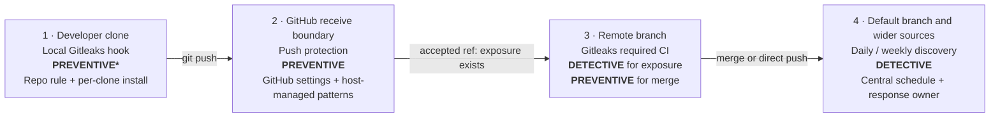

# Secret scanning: reducing credential leaks before they become incidents

> **Defensive scope:** This article and its executable example are for educational and defensive use on a local repository or a system the reader is explicitly authorized to test. The fixtures contain no live credential, contact no provider, and pair the vulnerable case with its mitigation.

Secret scanning is a detection and prevention control for credentials and other secret values that appear in source code, Git history, configuration, build artifacts, or collaboration systems. It reduces—but cannot eliminate—the chance that possession of a repository becomes possession of a production system.

The central engineering rule is simple: **catch a secret at the earliest practical point, enforce the decision again at the shared boundary, and store the real value somewhere designed for secret lifecycle management.** A scanner is not a secret manager, and a clean scan means only that the configured detectors did not report a match.

This article was last updated on **2026-08-25** using the primary references listed below. The checked-in corpus was run on GitHub Actions with Gitleaks 8.30.1 and TruffleHog 3.97.1. The added Mailchimp-shaped fixture was also pushed through the repository's enabled GitHub host controls, so the remote block and alert are reported separately from the CLI results.

## A practical definition of a secret

A **secret** is a value whose confidentiality is part of a security decision: possession lets a person or machine authenticate, authorize an action, decrypt data, sign an artifact, or impersonate a trusted party. Common examples include:

- passwords and database connection strings containing passwords;
- API keys, personal access tokens, OAuth tokens, session tokens, and webhook signing secrets;
- private SSH, TLS, code-signing, and package-signing keys;
- symmetric encryption keys and recovery codes;
- cloud access keys, service-account credentials, and CI/CD deployment credentials.

This is a practical engineering definition, not a formal taxonomy. [OWASP's Secrets Management Cheat Sheet](https://cheatsheetseries.owasp.org/cheatsheets/Secrets_Management_Cheat_Sheet.html) uses a similarly broad set of examples and emphasizes storage, provisioning, auditing, rotation, and revocation as one lifecycle.

Several related values are sensitive without being secrets. A cryptographic public key, a certificate's public portion, a hostname, or an OAuth client identifier normally does not authorize access by itself. Personal data and proprietary source code may require confidentiality controls, but a secret scanner is not a data-loss-prevention system and should not be represented as one.

## Why one leaked value becomes a business risk

A secret collapses an identity check into a reusable string or key. If that value is overprivileged, long-lived, or shared across environments, a small coding error can become a large authorization failure.

The direct technical effects can include unauthorized cloud or database access, data exfiltration, resource abuse, malicious software publication, deployment tampering, or service interruption. The business effects follow from that access: incident-response labor, emergency rotation and downtime, customer notification, contractual or regulatory exposure, fraud and cloud spend, supply-chain impact, and loss of trust.

The risk does not depend on a repository being public. Private repositories are copied to developer machines, CI runners, backups, mirrors, integrations, and third-party applications. Their access controls can also be bypassed by a compromised user or token.

### Real incidents show the complete path

| Incident | What happened | Decision it supports |
| --- | --- | --- |
| Uber, 2014 and 2016 | The US Federal Trade Commission alleged that a publicly posted AWS key with broad privileges enabled the 2014 access to driver data. In the 2016 breach, [Uber admitted that attackers used stolen credentials to enter a private source repository, obtained a private access key, and then copied data associated with about 57 million records](https://www.justice.gov/usao-ndca/pr/uber-enters-non-prosecution-agreement). | Public exposure is dangerous, but “private repository” is not a secret-storage control. Scope and repository access security determine blast radius. |
| GitHub/npm, 2022 | [GitHub reported that stolen OAuth tokens were used to download private repositories](https://github.blog/news-insights/company-news/security-alert-stolen-oauth-user-tokens/). Its investigation linked unauthorized npm infrastructure access to an AWS API key obtained from downloaded private npm repositories. | Attackers mine repositories for credentials that allow a second-stage pivot. Repository access and infrastructure access should not share one failure boundary. |
| CircleCI, 2023 | [CircleCI reported exfiltration of customer environment variables, keys, and tokens](https://circleci.com/blog/jan-4-2023-incident-report/) and told customers to rotate OAuth tokens, project API tokens, SSH keys, and other credentials. | CI secret stores are concentrated trust points. Reduce stored long-lived credentials and design rotation before an incident. |

These cases do not show that scanning alone would have prevented each incident. They describe the mechanism and impact: credentials stored with source or automation can be discovered after another control fails, then reused against a different system. Scanning is one control in that chain.

## If a secret reaches Git, treat it as an incident

Deleting the line in a later commit does not delete the earlier Git object. The value may remain in local clones, remote branches, pull-request references, forks, caches, build output, logs, or backups. History rewriting can reduce future exposure, but it cannot make a copied value unknown again.

Use this response order:

1. **Revoke or rotate first.** Invalidate the exposed credential at its issuing system. [GitHub's history-cleanup guidance](https://docs.github.com/en/authentication/keeping-your-account-and-data-secure/removing-sensitive-data-from-a-repository) explicitly puts revocation or rotation before repository rewriting.
2. **Preserve incident records and establish the exposure window.** Identify the first commit, every branch and surface containing the value, who or what could read it, and the time at which revocation completed.
3. **Check for use.** Review provider, identity, cloud, database, CI, and application audit logs for activity within that window. Scope the investigation to the permissions the credential actually had.
4. **Replace the storage pattern.** Move the value to an approved secret manager or workload identity flow, update consumers, and confirm the old credential no longer works.
5. **Remove the value from current content and decide whether to rewrite history.** Coordinate a rewrite with every clone owner. Rewriting changes commit hashes, invalidates signatures, can disrupt open work, and risks recontamination from an old clone.
6. **Search adjacent surfaces.** Check issues, pull requests, wikis, chat, CI logs, artifacts, container layers, package registries, and documentation for the same value or related credentials.
7. **Add a regression guard.** Create a safe detector test for the credential format and enforce it at the earliest gate plus a shared gate.

Do not commit a real leaked value as a scanner regression fixture. Use a provider's documented test token when one exists, or use a repository-only fictional format such as the controlled fixture in this repository.

## Judge a gate by control effectiveness, not only by where it runs

An early control is not automatically a governable control. A pre-commit hook can prevent a matching value from entering local Git history, but every developer must install it and can usually bypass it. A centrally required CI check is easier to govern, but a feature-branch secret has already reached the remote before CI reports it. The design must consider five dimensions together:

| Effectiveness dimension | Question to answer |
| --- | --- |
| Detection capability | Does the configured rule set detect the organization's actual credential formats without unacceptable noise? |
| Timing | Does the control run before the unacceptable event: local commit, first remote exposure, merge, deployment, or later discovery? |
| Enforcement | Can the organization require the control, prevent ordinary bypass, and fail safely when the scanner errors? |
| Operation | Is the control fast and reliable enough that people do not disable it, and are its versions and dependencies maintained? |
| Governance and response | Are ownership, exceptions, bypass reasons, audit events, metrics, revocation, and remediation defined and reviewable? |

A tool finding is therefore only one input to control effectiveness. Classify each control against the event it is meant to stop. A required CI scan is detective for first remote exposure because the branch is already on GitHub, but preventive for merge when branch rules require the status.



*Practical control map. The asterisk marks a developer-controlled preventive check that is not organization-wide enforcement. “Clean” means no configured detector fired; it does not assert that no secret exists.*

| Layer | Classification | Configuration and authority | Constraint that matters |
| --- | --- | --- | --- |
| Local pre-commit or pre-push | Preventive for local commit or first remote push, when installed and not bypassed | Repository rule plus a hook installed in each clone; developer-controlled | Fast feedback, but installation and bypass are not centrally governed |
| GitHub push protection | **Preventive at GitHub's receive boundary**, before an accepted push updates the remote ref | Enabled in GitHub repository, organization, or enterprise settings; GitHub runs the gate | In this public personal repository, supported provider patterns and the gate location are host-managed, not defined in a workflow file. A timeout can cause post-push scanning instead |
| Required Gitleaks CI | Detective for first remote exposure; preventive for merge or deployment when the exact status is required | Versioned repository configuration and workflow; branch or ruleset policy provides enforcement | Direct pushes and administrative bypass must be restricted if this status is meant to govern every production change |
| After-push, scheduled, organization, and artifact scans | Detective unless integrated before publication | Central workflow or platform schedule plus a response owner | Finds residue and wider sources after exposure; a finding must trigger triage, revocation, and remediation |

GitHub Secret Protection is the product suite; **push protection** is its push-time gate. GitHub documents that push protection blocks supported secrets before they reach a protected repository. Secret-scanning alerts raised after content is accepted are detective. In this repository, an administrator can enable the feature and govern bypass, but cannot edit GitHub's provider detector expressions or move the gate into a repository workflow.

Eligible organization-owned repositories on GitHub Team or GitHub Enterprise Cloud with GitHub Secret Protection can add [custom patterns](https://docs.github.com/en/code-security/how-tos/secure-your-secrets/customize-leak-detection/define-custom-patterns) and [generic pattern scanning](https://docs.github.com/en/code-security/how-tos/secure-your-secrets/detect-secret-leaks/enabling-secret-scanning-for-generic-patterns). GitHub also documents organization- and enterprise-level pattern selection as a public-preview setting. Those extensions change coverage and governance options; they do not change the gate's position at GitHub's host boundary.

The governable baseline is therefore not “install a hook.” Use local hooks for feedback, a host-side control for supported patterns that must not reach the remote, a required CI scan for portable and custom merge policy, and scheduled discovery for history and sources that preventive gates do not cover.

## What to evaluate in a secret-scanning tool

A feature count is less useful than a test against the organization's actual secrets, development flow, and authority model. These are **evaluation criteria, not ten mandatory features for one product**. Some apply to every blocking control; others become requirements only when the threat model or operating model needs them.

| # | Evaluation criterion | When it becomes a requirement |
| --- | --- | --- |
| 1 | **Coverage fit:** provider versions, generic credentials, paired values, private keys, encodings, and organization-specific formats | Always, but only for the credential inventory and representations the control is assigned to cover |
| 2 | **Placement and timing:** staged content, push boundary, pull request, deployment, history, or non-Git source | Always; choose the point before the business event the control must prevent |
| 3 | **Enforcement and governance:** required status, pre-receive policy, bypass authority, audit trail, and ownership | Always for a control represented as mandatory; optional developer feedback does not need to satisfy central governance |
| 4 | **Failure semantics:** finding exit codes, scanner errors, timeouts, fail-open behavior, and branch-rule integration | Always for a blocking gate |
| 5 | **Custom and internal formats:** versioned patterns, engine-specific regex syntax, decoding, positives, negatives, and dry runs | Required when the inventory contains formats no default detector knows |
| 6 | **History and source reach:** full refs, archives, images, CI logs, collaboration content, object stores, and organization enumeration | Required only for the sources assigned to that control; no checkout scanner must pretend to be an object-store scanner |
| 7 | **Signal and validity:** false positives, false negatives, optional provider checks, egress, rate limits, and indeterminate results | Required when active/inactive status changes triage priority or when noise threatens adoption |
| 8 | **Output and exception safety:** redaction, report access, fingerprints, narrow allowlists, owner, reason, and expiry | Always; the scanner and its exception process must not widen exposure |
| 9 | **Performance and reliability:** representative history size, binaries, submodules, archives, concurrency, and service limits | Required before making the control mandatory at scale |
| 10 | **Operational and commercial fit:** alert routing, deduplication, response integration, metrics, tool supply chain, maintenance, license, plan, cost, and data boundary | Required at the program or procurement layer, even when it is not a detector feature |

No single tool is expected to satisfy every possible scope in rows 5–10. The practical requirement is that the **control system** covers the organization's mandatory rows without an unowned gap. For this repository, the central blocking baseline needs tested file/Git coverage, a versioned custom rule, deterministic failure behavior, redacted output, and enforcement through branch protection. Wider-source discovery and provider validation are separate jobs, not reasons to reject an otherwise suitable merge gate.

## Comparing Gitleaks, TruffleHog, and GitHub Secret Protection

### Apply the evaluation criteria before selecting a gate

The comparison below separates three questions that are often collapsed:

1. **What did the pinned Gitleaks and TruffleHog configurations report on a GitHub-hosted runner?** The workflow asserts every scenario and publishes its JSON artifact.
2. **What did the enabled GitHub host control do with the committed fixtures?** GitHub's own push response and secret-scanning alert are recorded separately from the CLI output.
3. **What capability does the vendor document beyond this repository's plan?** Documentation describes features that were unavailable here; it is not substituted for an observed result.

The corpus contains 16 credential-shaped positive scenarios and three safe negatives. It represents major technical shapes—passwords, credential URLs, authorization headers, provider tokens, paired cloud keys, OAuth secrets, service accounts, private and symmetric keys, webhook secrets, internal formats, encoded material, runtime references, placeholders, and public keys. It is a regression sample, not a claim to contain every provider or token version.

Gitleaks and TruffleHog receive equivalent custom rules for the fictional internal format. Gitleaks is configured for one decoding pass. TruffleHog provider checks are disabled. Every non-issued value is committed under [`testdata/synthetic`](testdata/synthetic/) so future pattern changes use the same inputs locally and remotely.

Detector source is part of the result. **Built in** means the detector ships with the pinned scanner version. **Repository configured** means this repository supplied the rule in `.gitleaks.toml` or `.trufflehog.yml`; it is not out-of-box coverage. **Host managed** means GitHub supplied the provider pattern and executed it at the host boundary.

| Credential shape | Decision | Gitleaks 8.30.1 remote result and source | TruffleHog 3.97.1 remote result and source | GitHub host observation | GitHub documented capability |
| --- | --- | --- | --- | --- | --- |
| Custom internal token | Block | Detected: `synthetic-demo-api-key` — **repository configured** | Detected: `CustomRegex` — **repository configured** in `.trufflehog.yml` | Push accepted; repository custom-pattern API returned “feature not available” | Defaults cannot know the format; eligible repositories can dry-run, publish, and push-protect a custom pattern |
| Username/password assignment | Block | Detected: `generic-api-key` — built in | No finding | Push accepted; no user alert returned | Passwords are AI-detected alert patterns; push protection and validity checks are not supported |
| PostgreSQL credential URL | Block | No finding | Detected: `Postgres` — built in | Push accepted; no user alert returned | `postgres_connection_string` is a generic user-alert pattern |
| HTTP Basic credential | Block | No finding | No finding | Push accepted; no user alert returned | `http_basic_authentication_header` is a generic user-alert pattern |
| Bearer JWT/header | Block | Detected: `jwt` — built in | No finding | Push accepted; no user alert returned | `http_bearer_authentication_header` is generic; provider token patterns are separate |
| GitHub PAT-shaped token | Block | No finding | Detected: `Github` — built in | Push accepted; no user alert returned | Provider pattern and push protection apply only to supported identifiable token versions |
| Mailchimp API key-shaped token | Block | Detected: `mailchimp-api-key` — built in | No finding | **Push blocked by a host-managed Mailchimp pattern; `used_in_tests` bypass created [alert #1](https://github.com/llody9977/secret-scan/security/secret-scanning/1)** | `mailchimp_api_key` supports public user alerts and push protection; validity was not tested |
| OAuth client secret | Block | Detected: `generic-api-key` — built in | No finding | Push accepted; no user alert returned | Coverage depends on provider format or a custom pattern |
| AWS pair in one file | Block | Detected: `generic-api-key` — built in | Detected: `AWS` — built in | Push accepted; no user alert returned | AWS access-key-pair pattern supports push protection; a non-issued shape need not pass provider checks |
| AWS pair split across files | Block | Detected one generic value — built in | No finding | Push accepted; no user alert returned | Paired patterns are detected only when both parts occur in the same file |
| Service-account configuration with private key | Block | Detected: `private-key` — built in | Detected: `PrivateKey` — built in | Push accepted; no user alert returned | Provider-specific and generic private-key patterns differ |
| RSA private key | Block | Detected: `private-key` — built in | Detected: `PrivateKey` — built in | Push accepted; no user alert returned | `rsa_private_key` is a generic user-alert pattern |
| OpenSSH private key | Block | Detected: `private-key` — built in | Detected: `PrivateKey` — built in | Push accepted; no user alert returned | `openssh_private_key` is a generic user-alert pattern |
| Symmetric encryption key | Block | Detected: `generic-api-key` — built in | No finding | Push accepted; no user alert returned | Requires a recognized provider shape or custom pattern |
| Webhook signing secret | Block | Detected: `generic-api-key` — built in | No finding | Push accepted; no user alert returned | Requires a supported provider shape or custom pattern |
| Base64-encoded internal token | Block | Two signals: built-in `generic-api-key` plus **repository-configured** `synthetic-demo-api-key` after decoding | Detected: `CustomRegex` — **repository configured**; engine decoded the input before applying it | Push accepted; no user alert returned | Base64 support is pattern-specific; a plain custom pattern should not be assumed to decode content |
| Runtime reference | Pass | Passed | Passed | Push accepted; no user alert returned | No credential value is present |
| Placeholder | Pass | Passed | Passed | Push accepted; no user alert returned | No credential value is present |
| SSH public key | Pass | Passed | Passed | Push accepted; no user alert returned | A public key does not authenticate as the private key |

In [GitHub Actions run `32831205587`](https://github.com/llody9977/secret-scan/actions/runs/32831205587), Gitleaks detected 13 of the 16 positive scenarios and TruffleHog detected eight of 16; both passed the three negatives. The [machine-readable artifact](https://github.com/llody9977/secret-scan/actions/runs/32831205587/artifacts/9556823734) and checked-in [result snapshot](results/scanner-comparison-results.json) identify the runner, commit, manifest digest, detector names, exit codes, and per-scenario outcomes. Those fractions are not production accuracy rates: the cases are deliberately diverse, not statistically sampled, and one encoded value produces two Gitleaks signals. The useful facts are the individual gaps. Both missed the Basic-auth shape. Gitleaks missed the PostgreSQL URL and PAT-shaped token; TruffleHog missed the new Mailchimp shape as well as several generic assignments and JWT/OAuth/symmetric/webhook shapes.

GitHub's enabled push protection rejected commit [`bcc467f`](https://github.com/llody9977/secret-scan/commit/bcc467fc7e4d9a4db539acd6dd00e34a5f4dc1a7) before it reached the remote branch, named the Mailchimp pattern and fixture location, and offered a bypass URL. Selecting GitHub's **used in tests** reason allowed the same commit on retry and created [secret-scanning alert #1](https://github.com/llody9977/secret-scan/security/secret-scanning/1). The sanitized [host result](results/github-secret-protection-results.json) records the alert type, commit location, bypass, resolution, and settings without copying GitHub's raw `secret` field.

The other 15 positive fixtures had already been accepted without a host alert. Several are generic or internal formats, while this public personal repository could not enable non-provider generic patterns or custom patterns. The direct result is therefore: this free public-repository configuration blocked the tested provider-shaped Mailchimp value, but did not report the earlier synthetic formats. [GitHub documents free automatic scanning for public repositories](https://docs.github.com/en/code-security/how-tos/secure-your-secrets/detect-secret-leaks/enable-secret-scanning), while organization-owned repositories on GitHub Team or GitHub Enterprise Cloud with GitHub Secret Protection can add [custom patterns](https://docs.github.com/en/code-security/how-tos/secure-your-secrets/customize-leak-detection/define-custom-patterns) and [generic scanning](https://docs.github.com/en/code-security/how-tos/secure-your-secrets/detect-secret-leaks/enabling-secret-scanning-for-generic-patterns). Those untested configurations may close some gaps, but they are not part of this host result.

GitHub documents additional constraints: push protection covers only a subset of alert patterns; passwords are not push-protected; only supported token versions are blocked; and paired credentials are not combined across files. For public repositories, GitHub skips push-protection scans above 50 MB. A large or complex push can also time out and be accepted for post-push scanning; a push containing more than 1,000 already-alerted secrets is not blocked. The command line shows at most five newly detected secrets at a time. A business that relies on the host gate should therefore test provider-documented test credentials where safe, test its own custom formats on an eligible plan, and retain a portable central scanner for material gaps.

### Configuration ownership determines what can be changed

The earlier ten-question list is the selection rubric; repeating it as a feature-score table obscured the decision. The smaller matrix below answers a different question: who owns detection configuration and where can that configuration be governed?

| Control | Default detector source | Custom format support | Where configuration resides | What was exercised here |
| --- | --- | --- | --- | --- |
| Gitleaks 8.30.1 | Built-in rules shipped with the pinned binary | Yes; repository TOML rules | `.gitleaks.toml` and the workflow are versioned in the repository | Built-in rules plus the repository's `synthetic-demo-api-key` rule; one decoding pass |
| TruffleHog 3.97.1 | Built-in detectors shipped with the pinned binary | Yes; repository YAML custom detectors | `.trufflehog.yml` and the workflow are versioned in the repository | Built-in detectors plus the repository's custom detector, reported by the engine as `CustomRegex`; provider checks disabled |
| GitHub push protection | GitHub-managed supported patterns | Yes for eligible organization-owned repositories with GitHub Secret Protection; dry-run and publication precede optional push protection | GitHub repository, organization, or enterprise settings; not a repository workflow | Free public personal-repository provider scanning; the host-managed Mailchimp pattern blocked one push. Generic and custom configurations were unavailable and not tested |

The products are not interchangeable at one gate. Gitleaks supplies portable repository-owned merge policy, GitHub supplies the earlier host boundary for covered patterns, and TruffleHog supplies a different detector set plus optional wider-source and provider-check workflows. Add a second blocking engine only when its measured incremental coverage is worth its noise, latency, output-handling, and governance cost.

“Broad discovery” describes TruffleHog's **source reach and optional provider checks**, not a blanket claim that its file detector library is more effective. It can enumerate and scan places a checkout-based Gitleaks job does not see, including repositories across a GitHub organization, some collaboration content, object stores, container images, and CI systems. Its experimental GitHub object discovery can also search some deleted or otherwise hidden objects, with documented maturity and runtime caveats. The remote matrix shows why this distinction matters: TruffleHog found the PostgreSQL and GitHub-token shapes that Gitleaks missed, but missed other shapes that Gitleaks found.

### Custom formats need their own miniature test suite

All three products can model organization-specific formats, but “supports custom regex” is not enough:

- **Gitleaks:** version a TOML rule with keywords and a regular expression; use entropy or allowlists only when the format needs them. The repository's `DEMO_…` rule is exercised on plaintext and Base64-encoded input.
- **TruffleHog:** define keywords and one or more named regular expressions. Optional character requirements and a webhook/provider check can add structure. Raw result fields can include matched material, so report handling must be designed before the scanner is placed in CI.
- **GitHub:** on an eligible repository, dry-run a custom pattern before publishing it, then enable custom-pattern push protection only after reviewing likely disruption. This public personal repository's custom-pattern endpoint returned “feature not available,” so the internal format remains a Gitleaks/TruffleHog test rather than an invented GitHub result.

Maintain at least one safe positive for every supported version of an internal format and negatives for placeholders, public identifiers, documentation examples, and common near-matches. Re-run the cases when a pattern, scanner version, encoding setting, or GitHub feature configuration changes.

### Limitations of the repository experiment

- Sixteen positives and three negatives provide a useful regression matrix but cannot estimate false-positive or false-negative rates.
- The inputs are non-issued shapes, provider checks are disabled, and no result says whether a credential is active.
- Detection of one synthetic shape does not establish coverage of older, newer, shortened, transformed, or malformed versions of that credential.
- GitHub blocked one explicit provider-shaped scenario and recorded its test bypass; that single host finding cannot estimate coverage for other providers or token versions.
- The earlier 15 positives were accepted without a host alert. Disabled non-provider patterns, unavailable custom patterns, non-issued shapes, and feature-plan boundaries limit what can be concluded from those misses.
- TruffleHog JSON can contain raw matched material, so the harness keeps it in temporary storage and persists only safe metadata. Gitleaks is run with full redaction.
- The run does not benchmark large histories, archives, images, non-Git sources, collaboration surfaces, provider latency, false positives in production code, or operating cost.
- Tool versions, detector sets, token formats, hosted plans, and platform settings change; re-run the committed corpus and refresh the remote exports during procurement and upgrades.

## Recommendation: start with the lowest-effort governed boundary

| Rollout order | Action | Control classification | Governance condition |
| --- | --- | --- | --- |
| 1 | Enable GitHub secret scanning and repository push protection | Preventive at GitHub's receive boundary for covered patterns; post-acceptance alerts are detective | Review supported patterns, documented limits, bypass authority, and target-plan capability. The detector expressions remain host managed in this public personal repository |
| 2 | Offer Gitleaks pre-commit and pre-push hooks | Preventive local feedback | Treat hook installation as developer-controlled and bypassable; do not count it as organization-wide enforcement |
| 3 | Run Gitleaks on every push and pull request and require **Gitleaks full-history gate** | Detective for remote exposure; preventive for merge or deployment | Restrict direct pushes and administrative bypass, and fail on scanner errors as well as findings |
| 4 | Run Gitleaks daily and TruffleHog weekly or manually for approved wider sources | Detective hygiene, history, and residual-gap discovery | Route findings to an owner, keep raw output restricted, and enable provider checks only under an approved egress and data-handling decision |
| 5 | Connect every confirmed finding to incident triage | Corrective response | Revoke or rotate first, investigate use and exposure, replace the storage pattern, remove residue, and add a safe regression case |
| 6 | Re-run the committed corpus after tool, rule, or configuration changes | Change-control regression | Keep this job non-blocking; review changed scenarios before changing production policy |

If only one portable scanner can be operated, Gitleaks is the merge-policy baseline here because it supports versioned custom rules, full-redaction output, Git history, local feedback, and centrally required CI. The remote corpus supports that assignment for this repository; it does not make Gitleaks universally more accurate.

GitHub push protection comes first because it is already integrated at the earlier shared boundary that CI cannot occupy. It blocked the Mailchimp-shaped value before remote exposure and recorded the governed bypass. It should not be the only layer because the earlier 15 synthetic formats produced no host alert under this public-repository configuration. Eligible organization plans add options, but each assigned format still needs a target-plan test.

Add TruffleHog when one of its distinct outcomes or sources closes a material gap—for example, PostgreSQL URLs in this corpus, organization-wide repository enumeration, object stores, images, or approved provider checks. Promote it to a required CI gate only after measuring incremental coverage, false positives, latency, failure behavior, raw-output handling, egress, and license impact. Otherwise, keep it as scheduled discovery.

The practical conclusion is a governed stack, not “run all three everywhere”: host prevention for covered patterns, portable required CI for merge policy and internal formats, and additional discovery for an identified residual risk.

## Store fewer secrets, and store the remainder for their full lifecycle

The safest stored secret is one that does not exist. Prefer workload identity, short-lived federation, or dynamic credentials to a static key. For example, [GitHub Actions OpenID Connect](https://docs.github.com/en/actions/concepts/security/openid-connect) lets a workflow exchange its identity for a short-lived cloud token rather than duplicating a long-lived cloud credential in GitHub.

When a static secret is necessary, keep it in a centralized secret-management system such as a cloud secret manager, HashiCorp Vault, or an equivalent platform that provides:

- encryption at rest and in transit;
- fine-grained, least-privilege access by workload identity;
- audit logs for read, write, and administrative access;
- automated creation, rotation, expiry, and revocation;
- separation by application, environment, and trust boundary;
- a tested recovery and break-glass process.

Practical placement rules:

| Context | Preferred pattern | Important caveat |
| --- | --- | --- |
| Application runtime | Fetch or mount the value from a secret manager using workload identity; keep it in memory only as long as required | Environment variables can appear in child processes, diagnostics, or crash output; a permissioned file or provider integration may be safer depending on the platform |
| CI/CD | Prefer OIDC or another provider-supported workload identity flow. If a CI secret is unavoidable, scope it to the job/environment, protect deployment environments, mask logs, and rotate it | Maintainers or modified workflows may be able to cause a secret to be used or exfiltrated; CI is a production trust boundary |
| Local development | Use a password manager, operating-system credential store, or developer identity to retrieve a non-production secret. Keep local `.env` files ignored and short-lived | `.gitignore` is only a backstop. It does not protect a file already committed, force-added, logged, backed up, or copied |
| Kubernetes | Prefer an external secret store or configure Kubernetes Secrets with encryption at rest, least-privilege RBAC, and access only for the consuming container | [Kubernetes documents that Secret objects are stored unencrypted in etcd by default](https://kubernetes.io/docs/concepts/configuration/secret/); Base64 encoding is not encryption |
| Encrypted configuration in Git | Use only under a designed threat model with encryption keys held outside Git, separate recipients per environment, rotation, and audit | Encryption can be valid, but it shifts the problem to key management and can hide plaintext from a repository scanner |

Do not put live values in source, examples, unit-test fixtures, `.env.example`, documentation, screenshots, issue bodies, pull-request descriptions, chat, or log output. Store only the reference, identifier, or lookup path that the runtime needs.

## The repository's reproducible test results

The corpus is source-controlled so another pattern can be added without recreating hidden local inputs:

- [`testdata/synthetic/manifest.json`](testdata/synthetic/manifest.json) defines the 19 scenarios, fixture targets, desired control decisions, and expected detector metadata. The harness rejects duplicate targets and any checked-in fixture not covered by the manifest.
- [`testdata/synthetic/`](testdata/synthetic/) contains only non-issued values and newly generated, untrusted test keys.
- The production Gitleaks and TruffleHog scans exclude that exact directory. The remote evaluation workflow copies and scans it explicitly, so the exception cannot turn the regression test into a pass-by-allowlist.

The direct hosted results are:

| Control | Direct result | Recorded scope |
| --- | --- | --- |
| Gitleaks and TruffleHog corpus evaluation | [Actions run `32831205587`](https://github.com/llody9977/secret-scan/actions/runs/32831205587), [artifact `9556823734`](https://github.com/llody9977/secret-scan/actions/runs/32831205587/artifacts/9556823734), and [checked-in JSON](results/scanner-comparison-results.json) | Both pinned engines ran on GitHub's Linux/X64 runner against manifest digest `7c1c67…`; every outcome matched the manifest |
| Production Gitleaks history gate | [Job `97750057067`](https://github.com/llody9977/secret-scan/actions/runs/32831205515/job/97750057067) in run `32831205515` | The hosted summary reports no findings, Gitleaks 8.30.1, complete checked-out history, the exact excluded corpus path, control role, and report handling |
| Production TruffleHog discovery | [Job `97750093790`](https://github.com/llody9977/secret-scan/actions/runs/32831215517/job/97750093790) in run `32831215517` | The hosted summary reports no findings, TruffleHog 3.97.1, complete checked-out history, provider checks disabled, detective scope, and temporary raw-output handling |
| GitHub-hosted secret scanning | [Commit `bcc467f`](https://github.com/llody9977/secret-scan/commit/bcc467fc7e4d9a4db539acd6dd00e34a5f4dc1a7), [alert #1](https://github.com/llody9977/secret-scan/security/secret-scanning/1), and [sanitized host result](results/github-secret-protection-results.json) | GitHub blocked the Mailchimp-shaped fixture, then recorded the `used_in_tests` bypass, location, and resolution; no matched value is copied into the result |

Run the same committed corpus locally after installing the pinned binaries:

```sh
./scripts/compare-secret-scanners.sh
```

The remote workflow prints the complete per-scenario table into the GitHub job summary and uploads the JSON for 90 days. The checked-in copy provides a durable snapshot after artifact expiry. Raw TruffleHog JSON remains in the ephemeral script directory because it can contain matched values. Each Gitleaks `Secret` field must be exactly `REDACTED`, each non-empty contextual `Match` field must contain the redaction marker, and neither field is copied into the safe metadata.

The workflows deliberately have different semantics:

- [Secret scan](.github/workflows/gitleaks.yml) is a required main-branch status and also runs after pushes and daily; the current branch rule does not enforce administrators.
- [Remote scanner evaluation](.github/workflows/scanner-comparison.yml) is a regression job, explicitly **not a merge gate**.
- [TruffleHog discovery](.github/workflows/trufflehog-discovery.yml) is weekly/manual detective coverage and excludes the intentional corpus.
- GitHub push protection is host configuration; its result is not inferred from either CLI.

All download jobs pin versions, check archive checksums, use read-only repository permissions, and do not persist checkout credentials. These runs establish only the recorded behavior for the commit, manifest, versions, runner, and settings. They do not establish credential validity, production false-positive rates, large-repository performance, universal coverage, or absence of secrets.

## Operating checklist

- Enable GitHub secret scanning and push protection for the repository; document the tested pattern, plan, timeout, size, and bypass boundaries.
- Offer pre-commit and pre-push scanning as developer feedback, but do not represent clone-local installation as a centrally governed control.
- Run the portable central scan on every push and pull request and require the exact status for protected changes; restrict direct-push and administrative bypass.
- Run scheduled history and wider-source scans for hygiene and residual gaps; route candidate findings into owned triage.
- Treat every confirmed exposure as an incident: revoke or rotate first, investigate use, replace storage, remove residue, and add a guard.
- Inventory secret types, issuers, owners, scopes, storage locations, consumers, rotation methods, and revocation paths, then test scanner coverage against that inventory.
- Remove long-lived credentials through workload identity or dynamic secrets where possible.
- Keep scanner jobs least-privileged, pinned, checksum-checked, redacted, and isolated from unrelated secrets.
- Maintain safe positive and negative fixtures for provider and custom rules.
- Give exceptions an owner, narrow scope, rationale, and review date.
- Measure time to revoke and rotate, not only the number of findings.

> **What to remember:** Secret scanning is a layered control, not a guarantee of absence and not a secret store. Use local scans for feedback, govern prevention at the host boundary where possible, enforce portable policy in required CI, and design every real credential for least privilege, short lifetime, audit, rotation, and revocation.

## Primary references

- **[Gitleaks repository and documentation](https://github.com/gitleaks/gitleaks)** — current commands, configuration, scan modes, reporting, exit codes, pre-commit support, license, and security-patch-only maintenance posture.
- **[TruffleHog repository and documentation](https://github.com/trufflesecurity/trufflehog)** — supported sources, provider-check result classes, CI behavior, custom-detector status, and AGPL-3.0 licensing.
- **[TruffleHog custom-detector documentation](https://github.com/trufflesecurity/trufflehog/blob/main/pkg/custom_detectors/CUSTOM_DETECTORS.md)** — keyword and named-regex syntax, character requirements, optional webhook checks, and raw-result fields.
- **[GitHub: Enabling secret scanning](https://docs.github.com/en/code-security/how-tos/secure-your-secrets/detect-secret-leaks/enable-secret-scanning)** — current public, private/internal organization, user-owned, Team, Enterprise Cloud, and Enterprise Server availability boundaries.
- **[GitHub security features](https://docs.github.com/en/code-security/getting-started/github-security-features)** — public-repository features available without purchase and additional GitHub Secret Protection capabilities for eligible GitHub Team and Enterprise Cloud accounts.
- **[GitHub: Supported secret-scanning patterns](https://docs.github.com/en/code-security/reference/secret-security/supported-secret-scanning-patterns)** — provider, generic, AI-detected, and push-protection support, including the password limitation.
- **[GitHub: Enabling generic secret scanning](https://docs.github.com/en/code-security/how-tos/secure-your-secrets/detect-secret-leaks/enabling-secret-scanning-for-generic-patterns)** — organization ownership, Team plan, and GitHub Secret Protection eligibility for non-provider patterns.
- **[GitHub: Secret scanning detection scope](https://docs.github.com/en/code-security/reference/secret-security/secret-scanning-scope)** — pattern-pair behavior and push-protection pattern, size, timeout, and count limitations.
- **[GitHub: Defining custom patterns](https://docs.github.com/en/code-security/how-tos/secure-your-secrets/customize-leak-detection/define-custom-patterns)** — eligible organization plans, repository/organization/enterprise configuration locations, dry runs, publication, and optional push protection.
- **[GitHub: Managing custom patterns](https://docs.github.com/en/code-security/how-tos/secure-your-secrets/customize-leak-detection/manage-custom-patterns)** — dry runs, publishing, and push protection for organization-specific formats.
- **[GitHub: Configuring global security settings](https://docs.github.com/en/code-security/how-tos/secure-at-scale/configure-organization-security/establish-complete-coverage/configure-global-settings)** — organization- and enterprise-level pattern selection and its current public-preview status.
- **[GitHub: Push protection from the command line](https://docs.github.com/en/code-security/how-tos/secure-your-secrets/work-with-leak-prevention/push-protection-on-the-command-line)** — blocked-push behavior, bypass choices, and the three-hour retry window used by the hosted test.
- **[GitHub: Secret security with GitHub](https://docs.github.com/en/code-security/concepts/secret-security/secret-security-with-github)** — continuous-monitoring surfaces, push prevention, public monitoring, alert workflow, and governance capabilities.
- **[GitHub: OpenID Connect](https://docs.github.com/en/actions/concepts/security/openid-connect)** — replacing long-lived CI cloud credentials with short-lived provider tokens.
- **[GitHub: Removing sensitive data from a repository](https://docs.github.com/en/authentication/keeping-your-account-and-data-secure/removing-sensitive-data-from-a-repository)** — revocation-first response and history-rewrite side effects.
- **[OWASP Secrets Management Cheat Sheet](https://cheatsheetseries.owasp.org/cheatsheets/Secrets_Management_Cheat_Sheet.html)** — secret examples and storage, access, audit, rotation, revocation, and CI/CD lifecycle guidance.
- **[US Department of Justice: Uber 2016 breach agreement](https://www.justice.gov/usao-ndca/pr/uber-enters-non-prosecution-agreement)** and **[FTC revised complaint](https://www.ftc.gov/system/files/documents/cases/1523054_uber_technologies_revised_complaint_0.pdf)** — private-repository and public-key exposure mechanisms and resulting data access.
- **[GitHub: 2022 stolen OAuth token campaign](https://github.blog/news-insights/company-news/security-alert-stolen-oauth-user-tokens/)** — private-repository download, secret mining, and the npm AWS-key pivot.
- **[CircleCI January 2023 incident report](https://circleci.com/blog/jan-4-2023-incident-report/)** — exfiltrated CI secrets, rotation scope, and downstream investigation impact.
- **[Kubernetes Secrets](https://kubernetes.io/docs/concepts/configuration/secret/)** — default etcd storage caveat, encryption-at-rest, RBAC, container scoping, and external-store guidance.
